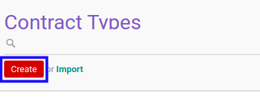
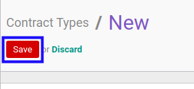

# Membuat Service Type

## A. INPUT

*(Tidak ada instruksi khusus)*

## B. LANGKAH KERJA

1. Buka menu **Service -> Configuration -> Service Type**. Abaikan jika sudah berada pada menu yang dimaksud.
2. Klik tombol **Create** pada bagian atas-kiri form.

3. Isi **[Type](./penjelasan.md#field-type)**. Wajib diisi.
4. Isi **[Code](./penjelasan.md#field-code)**. Wajib diisi.
5. Aktifkan/ Deaktifkan **[Active](./penjelasan.md#field-active)**. Tidak wajib diisi.
6. Pilih **[Contract Sequence](./penjelasan.md#field-contract-sequence)**. Tidak wajib diisi.
7. Pilih **[Custom Info Template](./penjelasan.md#field-custom-info-template)**. Tidak wajib diisi.
8. Beralih ke tab **[Fix Items Configuration](./penjelasan.md#tab-fix-items-configuration)**.
9. Pilih **[Receivable Journal](./penjelasan.md#field-receivable-journal)**. Tidak wajib diisi.
10. Pilih **[Receivable Account](./penjelasan.md#field-receivable-account)**. Tidak wajib diisi.
11. <a name="l11">[Tambah](./menambahkan-produk.md)/[Hapus](./menghapus-produk.md) **Allowed Products**</a>. Ulangi langkah ini sampai **Allowed Products** sesuai dengan keinginan.
12. <a name="l12">[Tambah](./menambahkan-kategori-produk.md)/[Hapus](./menghapus-kategori-produk.md) **Allowed Product Categories**</a>. Ulangi langkah ini sampai **Allowed Product Categories** sesuai dengan keinginan.
13. Beralih ke tab **[Team](./penjelasan.md#tab-team)**.
14. <a name="l14">[Tambah](./menambahkan-produk-team.md)/[Hapus](./menghapus-produk-team.md) **Allowed Products**</a>. Ulangi langkah ini sampai **Allowed Products** sesuai dengan keinginan.
15. <a name="l15">[Tambah](./menambahkan-kategori-produk-team.md)/[Hapus](./menghapus-kategori-produk-team.md) **Allowed Product Categories**</a>. Ulangi langkah ini sampai **Allowed Product Categories** sesuai dengan keinginan.
16. Beralih ke tab **[Analytic & Project](./penjelasan.md#tab-analytic-project)**.
17. Pilih **[Parent Analytic Account](./penjelasan.md#field-parent-analytic-account)**. Tidak wajib diisi.
18. Aktifkan/ Deaktifkan **[Auto Create Project](./penjelasan.md#field-auto-create-project)**. Tidak wajib diisi.
19. Beralih ke tab **[Workflow Policy](./penjelasan.md#tab-workflow-policy)**.
20. Pilih **[Allow To Confirm Contract](./penjelasan.md#field-allow-to-confirm)**. Tidak wajib diisi.
21. Pilih **[Allow To Restart Approval Contract](./penjelasan.md#field-allow-to-restart-approval)**. Tidak wajib diisi.
22. Pilih **[Allow To Force Start Contract](./penjelasan.md#field-allow-to-force-start)**. Tidak wajib diisi.
23. Pilih **[Allow To Force Finish Contract](./penjelasan.md#field-allow-to-force-finish)**. Tidak wajib diisi.
24. Pilih **[Allow To Terminate Contract](./penjelasan.md#field-allow-to-terminate)**. Tidak wajib diisi.
25. Pilih **[Allow To Cancel Contract](./penjelasan.md#field-allow-to-cancel)**. Tidak wajib diisi.
26. Pilih **[Allow To Restart Contract](./penjelasan.md#field-allow-to-restart)**. Tidak wajib diisi.
27. Beralih ke tab **[Service Quotation Configuration](./penjelasan.md#tab-service-quotation-configuration)**.
28. Pilih **[Quotation Sequence](./penjelasan.md#field-quotation-sequence)**. Tidak wajib diisi.
29. Pilih **[Quotation Custom Info Template](./penjelasan.md#field-quotation-template)**. Tidak wajib diisi.
30. Pilih **[Allow To Confirm Service Quotation](./penjelasan.md#field-allow-to-confirm-quotation)**. Tidak wajib diisi.
31. Pilih **[Allow To Restart Approval Service Quotation](./penjelasan.md#field-allow-to-restart-approval-quotation)**. Tidak wajib diisi.
32. Pilih **[Allow To Mark As Won Service Quotation](./penjelasan.md#field-mark-as-won)**. Tidak wajib diisi.
33. Pilih **[Allow To Mark As Lost Service Quotation](./penjelasan.md#field-mark-as-lost)**. Tidak wajib diisi.
34. Pilih **[Allow To Cancel Service Quotation](./penjelasan.md#field-allow-to-cancel-quotation)**. Tidak wajib diisi.
35. Pilih **[Allow To Restart Service Quotation](./penjelasan.md#field-allow-to-restart-quotation)**. Tidak wajib diisi.
36. Aktifkan/ Deaktifkan **[Required Start Date](./penjelasan.md#field-required-start-date)**. Tidak wajib diisi.
37. Aktifkan/ Deaktifkan **[Required End Date](./penjelasan.md#field-required-end-date)**. Tidak wajib diisi.
38. Beralih ke tab **[Note](./penjelasan.md#tab-note)**.
39. Isi **[Note](./penjelasan.md#field-note)**. Tidak wajib diisi.
40. Beralih ke tab **[Operating Unit](./penjelasan.md#tab-operating-unit)**.
41. Pilih **[Operating Unit](./penjelasan.md#field-operating-unit)**. Tidak wajib diisi.
42. Pilih **[Contract Sequence](./penjelasan.md#field-contract-sequence)**. Tidak wajib diisi.
43. Pilih **[Quotation Sequence](./penjelasan.md#field-quotation-sequence)**. Tidak wajib diisi.
44. Pilih **[Fix Item Receivable Journal](./penjelasan.md#field-fix-item-receivable-journal)**. Tidak wajib diisi.
45. Pilih **[Fix Item Receivable Account](./penjelasan.md#field-fix-item-receivable-account)**. Tidak wajib diisi.
46. Klik tombol **Save** pada bagian atas-kiri form.

## C. OUTPUT

*(Tidak ada instruksi khusus)*
