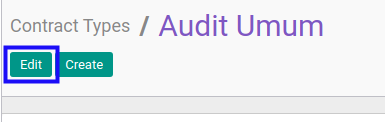
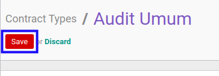

# Memodifikasi Service Type

## A. INPUT

* User yang akan memodifikasi harus memiliki akses untuk memodifikasi konfigurasi *Service Type*.

## B. LANGKAH KERJA

1. Buka menu **Service -> Configuration -> Service Type**. Abaikan jika sudah berada pada menu yang dimaksud.
2. Buka data *Service Type* yang akan dimodifikasi. Abaikan jika data sudah dibuka.
3. Klik tombol **Edit** pada bagian atas-kiri form.

4. Isi dan sesuaikan **[Type](./penjelasan.md#field-type)** jika dibutuhkan. Wajib diisi.
5. Isi dan sesuaikan **[Code](./penjelasan.md#field-code)** jika dibutuhkan. Wajib diisi.
6. Aktifkan/ Deaktifkan **[Active](./penjelasan.md#field-active)** jika dibutuhkan. Tidak wajib diisi.
7. Pilih dan sesuaikan **[Contract Sequence](./penjelasan.md#field-contract-sequence)** jika dibutuhkan. Tidak wajib diisi.
8. Pilih dan sesuaikan **[Custom Info Template](./penjelasan.md#field-custom-info-template)** jika dibutuhkan. Tidak wajib diisi.
9. Beralih ke tab **[Fix Items Configuration](./penjelasan.md#tab-fix-items-configuration)**.
10. Pilih dan sesuaikan **[Receivable Journal](./penjelasan.md#field-receivable-journal)** jika dibutuhkan. Tidak wajib diisi.
11. Pilih dan sesuaikan **[Receivable Account](./penjelasan.md#field-receivable-account)** jika dibutuhkan. Tidak wajib diisi.
12. <a name="l12">[Tambah](./menambahkan-produk.md)/[Hapus](./menghapus-produk.md) **Allowed Products**</a>. Ulangi langkah ini sampai **Allowed Products** sesuai dengan keinginan.
13. <a name="l13">[Tambah](./menambahkan-kategori-produk.md)/[Hapus](./menghapus-kategori-produk.md) **Allowed Product Categories**</a>. Ulangi langkah ini sampai **Allowed Product Categories** sesuai dengan keinginan.
14. Beralih ke tab **[Team](./penjelasan.md#tab-team)**.
15. <a name="l15">[Tambah](./menambahkan-produk-team.md)/[Hapus](./menghapus-produk-team.md) **Allowed Products**</a>. Ulangi langkah ini sampai **Allowed Products** sesuai dengan keinginan.
16. <a name="l16">[Tambah](./menambahkan-kategori-produk-team.md)/[Hapus](./menghapus-kategori-produk-team.md) **Allowed Product Categories**</a>. Ulangi langkah ini sampai **Allowed Product Categories** sesuai dengan keinginan.
17. Beralih ke tab **[Analytic & Project](./penjelasan.md#tab-analytic-project)**.
18. Pilih dan sesuaikan **[Parent Analytic Account](./penjelasan.md#field-parent-analytic-account)** jika dibutuhkan. Tidak wajib diisi.
19. Aktifkan/ Deaktifkan **[Auto Create Project](./penjelasan.md#field-auto-create-project)** jika dibutuhkan. Tidak wajib diisi.
20. Beralih ke tab **[Workflow Policy](./penjelasan.md#tab-workflow-policy)**.
21. Pilih dan sesuaikan **[Allow To Confirm Contract](./penjelasan.md#field-allow-to-confirm)** jika dibutuhkan. Tidak wajib diisi.
22. Pilih dan sesuaikan **[Allow To Restart Approval Contract](./penjelasan.md#field-allow-to-restart-approval)** jika dibutuhkan. Tidak wajib diisi.
23. Pilih dan sesuaikan **[Allow To Force Start Contract](./penjelasan.md#field-allow-to-force-start)** jika dibutuhkan. Tidak wajib diisi.
24. Pilih dan sesuaikan **[Allow To Force Finish Contract](./penjelasan.md#field-allow-to-force-finish)** jika dibutuhkan. Tidak wajib diisi.
25. Pilih dan sesuaikan **[Allow To Terminate Contract](./penjelasan.md#field-allow-to-terminate)** jika dibutuhkan. Tidak wajib diisi.
26. Pilih dan sesuaikan **[Allow To Cancel Contract](./penjelasan.md#field-allow-to-cancel)** jika dibutuhkan. Tidak wajib diisi.
27. Pilih dan sesuaikan **[Allow To Restart Contract](./penjelasan.md#field-allow-to-restart)** jika dibutuhkan. Tidak wajib diisi.
28. Beralih ke tab **[Service Quotation Configuration](./penjelasan.md#tab-service-quotation-configuration)**.
29. Pilih dan sesuaikan **[Quotation Sequence](./penjelasan.md#field-quotation-sequence)** jika dibutuhkan. Tidak wajib diisi.
30. Pilih dan sesuaikan **[Quotation Custom Info Template](./penjelasan.md#field-quotation-template)** jika dibutuhkan. Tidak wajib diisi.
31. Pilih dan sesuaikan **[Allow To Confirm Service Quotation](./penjelasan.md#field-allow-to-confirm-quotation)** jika dibutuhkan. Tidak wajib diisi.
32. Pilih dan sesuaikan **[Allow To Restart Approval Service Quotation](./penjelasan.md#field-allow-to-restart-approval-quotation)** jika dibutuhkan. Tidak wajib diisi.
33. Pilih dan sesuaikan **[Allow To Mark As Won Service Quotation](./penjelasan.md#field-mark-as-won)** jika dibutuhkan. Tidak wajib diisi.
34. Pilih dan sesuaikan **[Allow To Mark As Lost Service Quotation](./penjelasan.md#field-mark-as-lost)** jika dibutuhkan. Tidak wajib diisi.
35. Pilih dan sesuaikan **[Allow To Cancel Service Quotation](./penjelasan.md#field-allow-to-cancel-quotation)** jika dibutuhkan. Tidak wajib diisi.
36. Pilih dan sesuaikan **[Allow To Restart Service Quotation](./penjelasan.md#field-allow-to-restart-quotation)** jika dibutuhkan. Tidak wajib diisi.
37. Aktifkan/ Deaktifkan **[Required Start Date](./penjelasan.md#field-required-start-date)** jika dibutuhkan. Tidak wajib diisi.
38. Aktifkan/ Deaktifkan **[Required End Date](./penjelasan.md#field-required-end-date)** jika dibutuhkan. Tidak wajib diisi.
39. Beralih ke tab **[Note](./penjelasan.md#tab-note)**.
40. Isi dan sesuaikan **[Note](./penjelasan.md#field-note)** jika dibutuhkan. Tidak wajib diisi.
41. Beralih ke tab **[Operating Unit](./penjelasan.md#tab-operating-unit)**.
42. <a name="l42">[Tambah](./menambahkan-operating-unit.md)/[Modifikasi](./memodifikasi-operating-unit.md)/[Hapus](./menghapus-operating-unit.md) **Operating Unit**</a>. Ulangi langkah ini sampai **Operating Unit** sesuai dengan keinginan.
43. Klik tombol **Save** pada bagian atas-kiri form.

## C. OUTPUT

* Data *Service Type* akan berubah sesuai dengan perubahan yang dilakukan.
