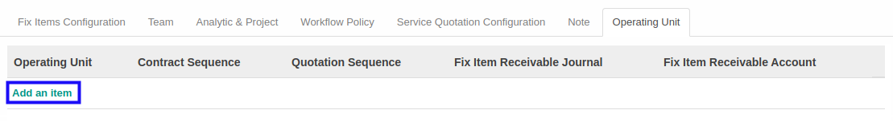

# Menambahkan Operating Unit

*(Instruksi kerja ini merupakan sub instruksi dari (1) [Membuat Service Type](./membuat.md), atau (2) [Memodifikasi Service Type](./memodifikasi.md). Instruksi kerja ini tidak bisa berdiri sendiri)*

## A. INPUT

*(Tidak ada instruksi khusus)*

## B. LANGKAH KERJA

1. Klik label **Add an Item** pada bagian atas-kiri tabel ***Operating Unit***

2. Pilih **[Operating Unit](./penjelasan.md#field-operating-unit)**. Tidak wajib diisi.
3. Pilih **[Contract Sequence](./penjelasan.md#field-contract-sequence)**. Tidak wajib diisi.
4. Pilih **[Quotation Sequence](./penjelasan.md#field-quotation-sequence)**. Tidak wajib diisi.
5. Pilih **[Fix Item Receivable Journal](./penjelasan.md#field-fix-item-receivable-journal)**. Tidak wajib diisi.
6. Pilih **[Fix Item Receivable Account](./penjelasan.md#field-fix-item-receivable-account)**. Tidak wajib diisi.
7. Lanjutkan [langkah ke-41 instruksi kerja Membuat Service Type](./membuat.md#l41) atau [langkah ke-42 instruksi kerja Memodifikasi Service Type](./memodifikasi.md#l42).

## C. OUTPUT

*(Tidak ada instruksi khusus)*
