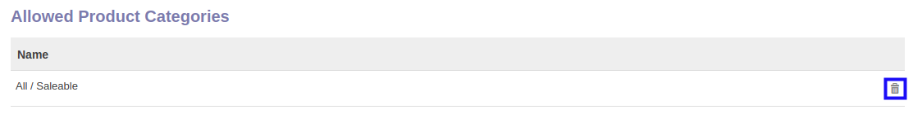

# Menghapus Kategori Produk

*(Instruksi kerja ini merupakan sub instruksi dari (1) [Membuat Service Type](./membuat.md), atau (2) [Memodifikasi Service Type](./memodifikasi.md). Instruksi kerja ini tidak bisa berdiri sendiri)*

## A. INPUT

*(Tidak ada instruksi khusus)*

## B. LANGKAH KERJA

1. Klik icon tempat sampah pada bagian kanan **Allowed Product Categories** yang akan dihapus.

2. Ulangi langkah ke-1 untuk setiap kategori produk yang akan dihapus.
3. Lanjutkan [langkah ke-11 instruksi kerja Membuat Service Type](./membuat.md#l11) atau [langkah ke-12 instruksi kerja Memodifikasi Service Type](./memodifikasi.md#l12).

## C. OUTPUT

*(Tidak ada instruksi khusus)*
