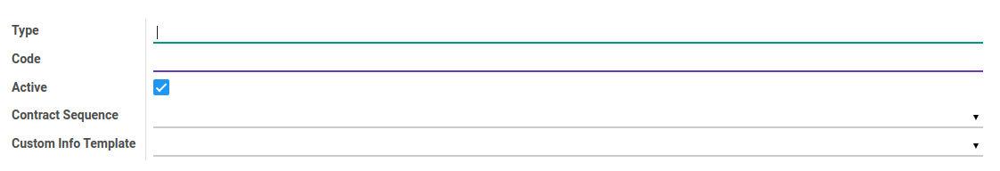
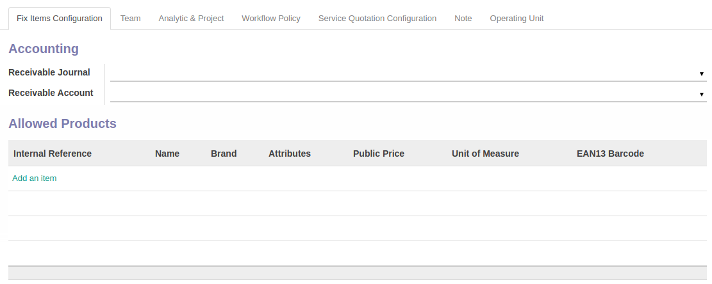
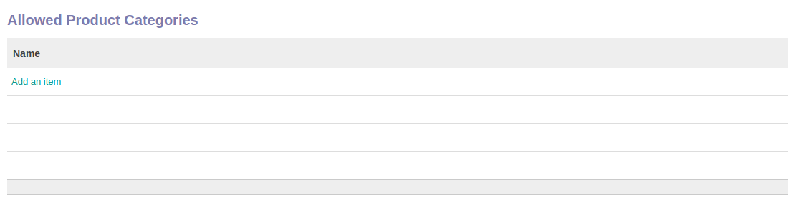
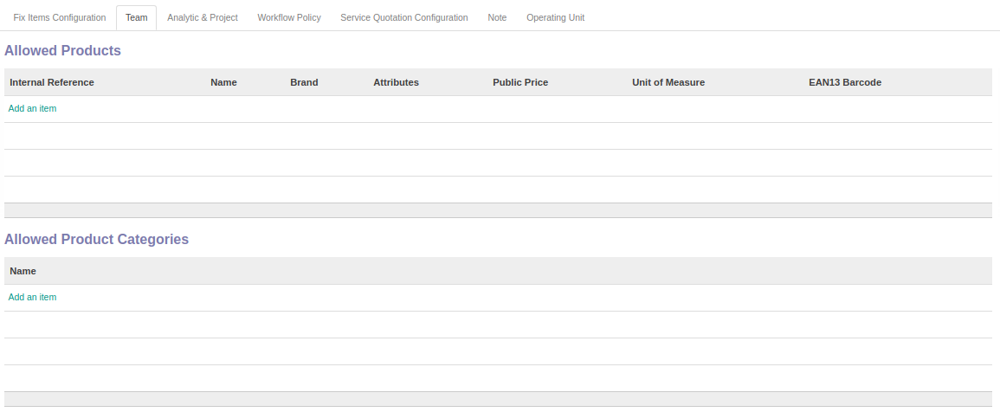
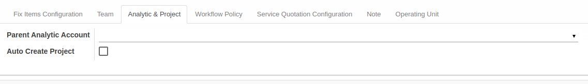
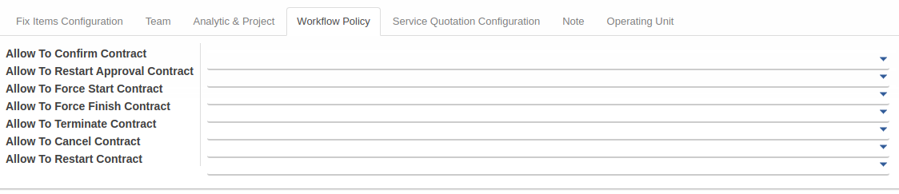
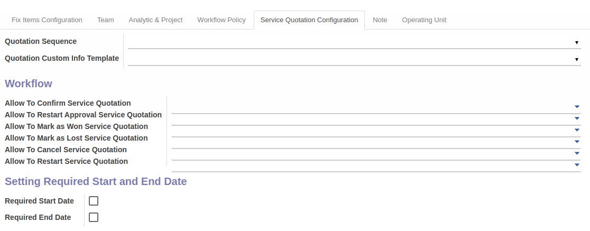
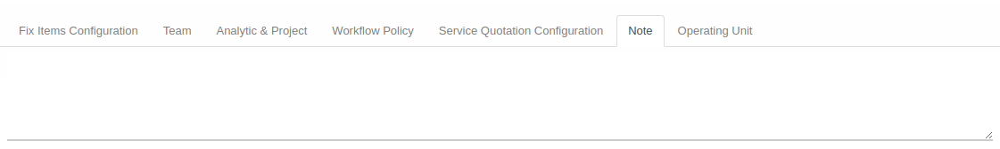
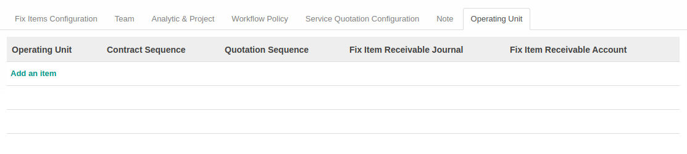

# Penjelasan Service Type

Informasi pada *Service Type* dibagi menjadi beberapa bagian, yaitu:

* [Header](#bagian-header)
* [Tab Fix Items Configuration](#tab-fix-items-configuration)
* [Tab Team](#tab-team)
* [Tab Analytic & Project](#tab-analytic-project)
* [Tab Workflow Policy](#tab-workflow-policy)
* [Tab Service Quotation Configuration](#tab-service-quotation-configuration)
* [Tab Note](#tab-note)
* [Tab Operating Unit](#tab-operating-unit)

### <a name="bagian-header">HEADER</a>

#### <a name="field-type">Type</a>

Tipe Service.

#### <a name="field-code">Code</a>

Kode Service.

#### <a name="field-active">Active</a>

Penanda status Service aktif.

#### <a name="field-contract-sequence">Contract Sequence</a>

Sequence yang digunakan.

#### <a name="field-custom-info-template">Custom Info Template</a>

Template yang digunakan.

### <a name="tab-fix-items-configuration">TAB FIX ITEMS CONFIGURATION</a>

#### <a name="field-receivable-journal">Receivable Journal</a>

Receivable Journal yang digunakan.

#### <a name="field-receivable-account">Receivable Account</a>

Receivable Account yang digunakan.

#### <a name="field-allowed-product">Allowed Product</a>

Tabel allowed product akan berisi produk yang diperbolehkan untuk digunakan.

#### <a name="field-allowed-product-categories">Allowed Product Categories</a>

Tabel allowed product categories akan berisi kategori produk yang diperbolehkan untuk digunakan.

### <a name="tab-team">TAB TEAM</a>

#### <a name="field-team-allowed-product">Allowed Product</a>

Tabel allowed product akan berisi produk yang diperbolehkan untuk digunakan.

#### <a name="field-team-allowed-product-categories">Allowed Product Categories</a>

Tabel allowed product categories akan berisi kategori produk yang diperbolehkan untuk digunakan.

### <a name="tab-analytic-project">TAB ANALYTIC & PROJECT</a>

#### <a name="field-parent-analytic-account">Parent Analytic Account</a>

Parent Analytic Account yang digunakan.

#### <a name="field-auto-create-project">Auto Create Project</a>

Penanda project dibuat secara otomatis.

### <a name="tab-workflow-policy">TAB WORKFLOW POLICY</a>

#### <a name="field-allow-to-confirm">Allow To Confirm Contract</a>

Kebijakan untuk mengkonfirmasi kontrak.

#### <a name="field-allow-to-restart-approval">Allow To Restart Approval Contract</a>

Kebijakan untuk merestart persetujuan kontrak.

#### <a name="field-allow-to-force-start">Allow To Force Start Contract</a>

Kebijakan untuk memaksa memulai kontrak.

#### <a name="field-allow-to-force-finish">Allow To Force Finish Contract</a>

Kebijakan untuk memaksa menyelesaikan kontrak.

#### <a name="field-allow-to-terminate">Allow To Terminate Contract</a>

Kebijakan untuk memaksa mengakhiri kontrak.

#### <a name="field-allow-to-cancel">Allow To Cancel Contract</a>

Kebijakan untuk membatalkan kontrak.

#### <a name="field-allow-to-restart">Allow To Restart Contract</a>

Kebijakan untuk merestart kontrak.

### <a name="tab-service-quotation-configuration">TAB SERVICE QUOTATION CONFIGURATION</a>

#### <a name="field-quotation-sequence">Quotation Sequence</a>

Quotation Sequence yang digunakan.

#### <a name="field-quotation-template">Quotation Custom Info Template</a>

Quotation Custom Info Template yang digunakan.

#### <a name="field-allow-to-confirm-quotation">Allow To Confirm Service Quotation</a>

Kebijakan untuk mengkonfirmasi service quotation.

#### <a name="field-allow-to-restart-approval-quotation">Allow To Restart Approval Service Quotation</a>

Kebijakan untuk merestart persetujuan service quotation.

#### <a name="field-mark-as-won">Allow To Mark As Won Service Quotation</a>

Kebijakan untuk menandakan service quotation telah menang.

#### <a name="field-mark-as-lost">Allow To Mark As Lost Service Quotation</a>

Kebijakan untuk menandakan service quotation telah kalah.

#### <a name="field-allow-to-cancel-quotation">Allow To Cancel Service Quotation</a>

Kebijakan untuk membatalkan service quotation.

#### <a name="field-allow-to-restart-quotation">Allow To Restart Service Quotation</a>

Kebijakan untuk merestart Service Quotation.

#### <a name="field-required-start-date">Required Start Date</a>

Penanda diperlukan tanggal mulai.

#### <a name="field-required-end-date">Required End Date</a>

Penanda diperlukan tanggal selesai.

### <a name="tab-note">TAB NOTE</a>

#### <a name="field-note">Note</a>

Catatan tambahan.

### <a name="tab-operating-unit">TAB OPERATING UNIT</a>

#### <a name="field-operating-unit">Operating Unit</a>

Nama operating unit.

#### <a name="field-contract-sequence">Contract Sequence</a>

Contract Sequence yang digunakan.

#### <a name="field-quotation-sequence">Quotation Sequence</a>

Quotation Sequence yang digunakan.

#### <a name="field-fix-item-receivable-journal">Fix Item Receivable Journal</a>

Fix Item Receivable Journal yang digunakan.

#### <a name="field-fix-item-receivable-account">Fix Item Receivable Account</a>

Fix Item Receivable Account yang digunakan.
