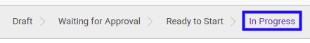
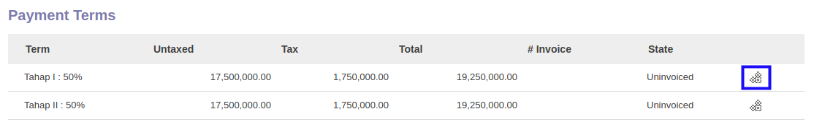

# Membuat Customer Invoice Dari Payment Term

## A. INPUT

* *Service Contract* yang dapat dibuat customer invoice harus memiliki status **In Progress**.

* User yang akan membuat customer invoice harus memiliki akses untuk membuat customer invoice *Service Contract*.

## B. LANGKAH KERJA

1. Buka menu **Service -> Service -> Contract**. Abaikan jika sudah berada pada menu yang dimaksud.
2. Buka data *Service Contract* yang akan dibuat customer invoice. Abaikan jika data sudah dibuka.
3. Beralih ke tab **[Fix Items](./penjelasan.md#tab-fix-items)**.
4. Klik icon roda gigi pada bagian kanan data **Payment Term** yang akan dibuat customer invoice.

## C. OUTPUT

* Data **Payment Term** *Service Contract* akan berubah menjadi **Invoiced**.

