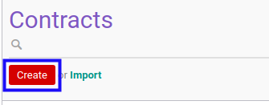
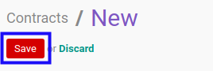

# Membuat Service Contract

## A. INPUT

*(Tidak ada instruksi khusus)*

## B. LANGKAH KERJA

1. Buka menu **Service -> Service -> Contract**. Abaikan jika sudah berada pada menu yang dimaksud.
2. Klik tombol **Create** pada bagian atas-kiri form.

3. Ubah **[# Document](./penjelasan.md#field-no-document)** dengan penomeran yang dikehendaki. Biarkan berisi **/** apabila menghendaki penomeran otomatis.
4. Isi **[Title](./penjelasan.md#field-title)**. Wajib diisi.
5. Pilih **[Default Operating Unit](./penjelasan.md#field-default-operating-unit)**. Tidak wajib diisi.
6. Pilih **[Partner](./penjelasan.md#field-partner)**. Wajib diisi.
7. Pilih **[Type](./penjelasan.md#field-type)**. Wajib diisi.
8. Pilih **[Salesman](./penjelasan.md#field-salesman)**. Wajib diisi.
9. Pilih **[Responsible](./penjelasan.md#field-responsible)**. Wajib diisi.
10. Pilih **[Currency](./penjelasan.md#field-currency)**. Wajib diisi.
11. Pilih **[Pricelist](./penjelasan.md#field-pricelist)**. Wajib diisi.
12. Pilih **[Contract Date](./penjelasan.md#field-contract-date)**. Wajib diisi.
13. Pilih **[Start Date](./penjelasan.md#field-start-date)**. Tidak wajib diisi.
14. Pilih **[End Date](./penjelasan.md#field-end-date)**. Tidak wajib diisi.
15. Beralih ke tab **[Fix Items](./penjelasan.md#tab-fix-items)**.
16. Pilih **[Receivable Journal](./penjelasan.md#field-receivable-journal)**. Tidak wajib diisi.
17. Pilih **[Receivable Account](./penjelasan.md#field-receivable-account)**. Tidak wajib diisi.
18. <a name="l18">[Tambah](./menambahkan-termin.md)/[Modifikasi](./memodifikasi-termin.md)/[Hapus](./menghapus-termin.md) **Payment Terms**</a>. Ulangi langkah ini sampai **Payment Terms** sesuai dengan keinginan.
19. Beralih ke tab **[Teams](./penjelasan.md#tab-teams)**.
20. <a name="l20">[Tambah](./menambahkan-team.md)/[Modifikasi](./memodifikasi-team.md)/[Hapus](./menghapus-team.md) **Team**</a>. Ulangi langkah ini sampai **Team** sesuai dengan keinginan.
21. Beralih ke tab **[Analytic & Project](./penjelasan.md#tab-analytic-project)**.
22. Pilih **[Parent Analytic Account](./penjelasan.md#field-parent-analytic-account)**. Tidak wajib diisi.
23. Pilih **[Analytic Account](./penjelasan.md#field-analytic-account)**. Tidak wajib diisi.
24. Aktifkan/ Deaktifkan **[Auto Create Project](./penjelasan.md#field-auto-create-project)**. Tidak wajib diisi.
25. Pilih **[Project](./penjelasan.md#field-project)**. Tidak wajib diisi.
26. Klik tombol **Save** pada bagian atas-kiri form.

## C. OUTPUT

* Data *Service Contract* akan terbuat dengan status **Draft**

