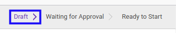
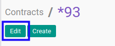
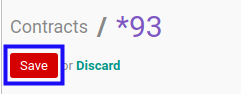

# Memodifikasi Service Contract

## A. INPUT

* Data *Service Contract* yang dapat dimodifikasi harus memiliki status **Draft**.

* User yang akan memodifikasi harus memiliki akses untuk memodifikasi *Service Contract*.

## B. LANGKAH KERJA

1. Buka menu **Service -> Service -> Contract**. Abaikan jika sudah berada pada menu yang dimaksud.
2. Buka data *Service Contract* yang akan dimodifikasi. Abaikan jika data sudah dibuka.
3. Klik tombol **Edit** pada bagian atas-kiri form.

4. Ubah **[# Document](./penjelasan.md#field-no-document)** jika dibutuhkan. Wajib diisi.
5. Isi dan sesuaikan **[Title](./penjelasan.md#field-title)** jika dibutuhkan. Wajib diisi.
6. Pilih dan sesuaikan **[Default Operating Unit](./penjelasan.md#field-default-operating-unit)** jika dibutuhkan. Tidak wajib diisi.
7. Pilih dan sesuaikan **[Partner](./penjelasan.md#field-partner)** jika dibutuhkan. Wajib diisi.
8. Pilih dan sesuaikan **[Type](./penjelasan.md#field-type)** jika dibutuhkan. Wajib diisi.
9. Pilih dan sesuaikan **[Salesman](./penjelasan.md#field-salesman)** jika dibutuhkan. Wajib diisi.
10. Pilih dan sesuaikan **[Responsible](./penjelasan.md#field-responsible)** jika dibutuhkan. Wajib diisi.
11. Pilih dan sesuaikan **[Currency](./penjelasan.md#field-currency)** jika dibutuhkan. Wajib diisi.
12. Pilih dan sesuaikan **[Pricelist](./penjelasan.md#field-pricelist)** jika dibutuhkan. Wajib diisi.
13. Pilih dan sesuaikan **[Contract Date](./penjelasan.md#field-contract-date)** jika dibutuhkan. Wajib diisi.
14. Pilih dan sesuaikan **[Start Date](./penjelasan.md#field-start-date)** jika dibutuhkan. Tidak wajib diisi.
15. Pilih dan sesuaikan **[End Date](./penjelasan.md#field-end-date)** jika dibutuhkan. Tidak wajib diisi.
16. Beralih ke tab **[Fix Items](./penjelasan.md#tab-fix-items)**.
17. Pilih dan sesuaikan **[Receivable Journal](./penjelasan.md#field-receivable-journal)** jika dibutuhkan. Tidak wajib diisi.
18. Pilih dan sesuaikan **[Receivable Account](./penjelasan.md#field-receivable-account)** jika dibutuhkan. Tidak wajib diisi.
19. <a name="l19">[Tambah](./menambahkan-termin.md)/[Modifikasi](./memodifikasi-termin.md)/[Hapus](./menghapus-termin.md) **Payment Terms**</a>. Ulangi langkah ini sampai **Payment Terms** sesuai dengan keinginan.
20. Beralih ke tab **[Teams](./penjelasan.md#tab-teams)**.
21. <a name="l21">[Tambah](./menambahkan-team.md)/[Modifikasi](./memodifikasi-team.md)/[Hapus](./menghapus-team.md) **Team**</a>. Ulangi langkah ini sampai **Team** sesuai dengan keinginan.
22. Beralih ke tab **[Analytic & Project](./penjelasan.md#tab-analytic-project)**.
23. Pilih dan sesuaikan **[Parent Analytic Account](./penjelasan.md#field-parent-analytic-account)** jika dibutuhkan. Tidak wajib diisi.
24. Pilih dan sesuaikan **[Analytic Account](./penjelasan.md#field-analytic-account)** jika dibutuhkan. Tidak wajib diisi.
25. Aktifkan/ Deaktifkan **[Auto Create Project](./penjelasan.md#field-auto-create-project)** jika dibutuhkan. Tidak wajib diisi.
26. Pilih dan sesuaikan **[Project](./penjelasan.md#field-project)** jika dibutuhkan. Tidak wajib diisi.
27. Klik tombol **Save** pada bagian atas-kiri form.

## C. OUTPUT

* Data *Service Contract* akan berubah sesuai dengan perubahan yang dilakukan.
