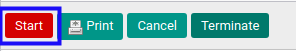
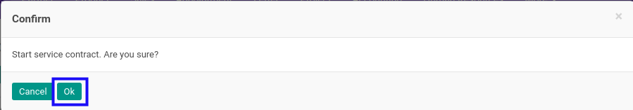

# Memulai Service Contract

## A. INPUT

* Data *Service Contract* yang dapat dimulai harus memiliki status **Ready to Start**.

* User yang akan memulai harus memiliki akses untuk memulai *Service Contract*.

## B. LANGKAH KERJA

1. Buka menu **Service -> Service -> Contract**. Abaikan jika sudah berada pada menu yang dimaksud.
2. Buka data *Service Contract* yang akan dimulai. Abaikan jika data sudah dibuka.
3. Klik tombol **Start** pada bagian atas-kiri form.

4. Klik tombol **Ok** pada *pop-up* konfirmasi confirm yang muncul.

## C. OUTPUT

* Status dari *Service Contract* akan berubah menjadi **In Progress**.

