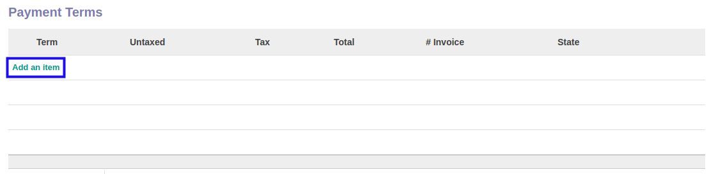
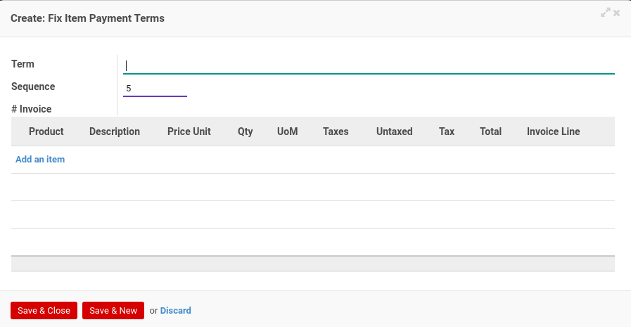

# Menambahkan Termin Pembayaran

*(Instruksi kerja ini merupakan sub instruksi dari (1) [Membuat Service Contract](./membuat.md), atau (2) [Memodifikasi Service Contract](./memodifikasi.md). Instruksi kerja ini tidak bisa berdiri sendiri)*

## A. INPUT

*(Tidak ada instruksi khusus)*

## B. LANGKAH KERJA

1. Klik label **Add an Item** pada bagian atas-kiri tabel ***Payment Terms***

Pop-up ***Payment Terms*** akan muncul.

3. Isi **[Term](./penjelasan.md#field-term)**. Wajib diisi.
4. Isi **[Sequence](./penjelasan.md#field-sequence)**. Wajib diisi.
5. <a name="l5">[Tambah](./menambahkan-detail-termin.md)/[Modifikasi](./memodifikasi-detail-termin.md)/[Hapus](./menghapus-detail-termin.md) **Product**</a>. Ulangi langkah ini sampai **Product** sesuai dengan keinginan.
6. Klik tombol **Save & Close** pada bagian bawah-kiri pop-up **Payment Terms** untuk menyimpan data. Klik tombol **Save & New** pada bagian bawah-kiri pop-up **Payment Terms** untuk menyimpan data dan menambahkan data baru.

7. Ulangi langkah ke-5 jika pada langkah ke-6 tombol **Save & New** yang dipilih.
8. Lanjutkan [langkah ke-18 instruksi kerja Membuat Service Contract](./membuat.md#l18) atau [langkah ke-19 instruksi kerja Memodifikasi Service Contract](./memodifikasi.md#l19).

## C. OUTPUT

*(Tidak ada instruksi khusus)*
