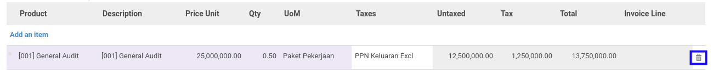

# Menghapus Detail Termin Pembayaran

*(Instruksi kerja ini merupakan sub instruksi dari (1) [Menambahkan Termin Pembayaran](./menambahkan-termin.md), atau (2) [Memodifikasi Termin Pembayaran](./memodifikasi-termin.md). Instruksi kerja ini tidak bisa berdiri sendiri)*

## A. INPUT

*(Tidak ada instruksi khusus)*

## B. LANGKAH KERJA

1. Klik icon tempat sampah pada bagian kanan data **Product** yang akan dihapus.

2. Lanjutkan [langkah ke-5 instruksi kerja Menambahkan Termin Pembayaran](./menambahkan-termin.md#l5) atau [langkah ke-4 instruksi kerja Memodifikasi Termin Pembayaran](./memodifikasi-termin.md#l4).

## C. OUTPUT

*(Tidak ada instruksi khusus)*
