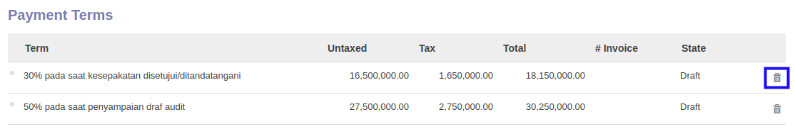

# Menghapus Termin Pembayaran

*(Instruksi kerja ini merupakan sub instruksi dari (1) [Membuat Service Contract](./membuat.md), atau (2) [Memodifikasi Service Contract](./memodifikasi.md). Instruksi kerja ini tidak bisa berdiri sendiri)*

## A. INPUT

*(Tidak ada instruksi khusus)*

## B. LANGKAH KERJA

1. Klik icon tempat sampah pada bagian kanan data **Payment Terms** yang akan dihapus.

2. Lanjutkan [langkah ke-18 instruksi kerja Membuat Service Contract](./membuat.md#l18) atau [langkah ke-19 instruksi kerja Memodifikasi Service Contract](./memodifikasi.md#l19).

## C. OUTPUT

*(Tidak ada instruksi khusus)*
