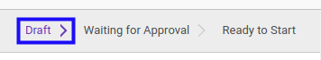

# Merestart Service Contract

## A. INPUT

* Data *Service Contract* yang akan direstart harus memiliki status **Cancelled**.

* User yang akan merestart harus memiliki akses untuk merestart Service Contract.

## B. LANGKAH KERJA

1. Buka menu **Service -> Service -> Contract**. Abaikan jika sudah berada pada menu yang dimaksud.
2. Buka data *Service Contract* yang akan direstart. Abaikan jika data sudah dibuka.
3. Klik tombol **Restart** pada bagian atas-kiri form.

4. Klik tombol **Ok** pada *pop-up* konfirmasi restart yang muncul.

## C. OUTPUT

* Status dari *Service Contract* akan berubah menjadi **Draft**.

* *Service Contract* dapat kembali dimodifikasi.
