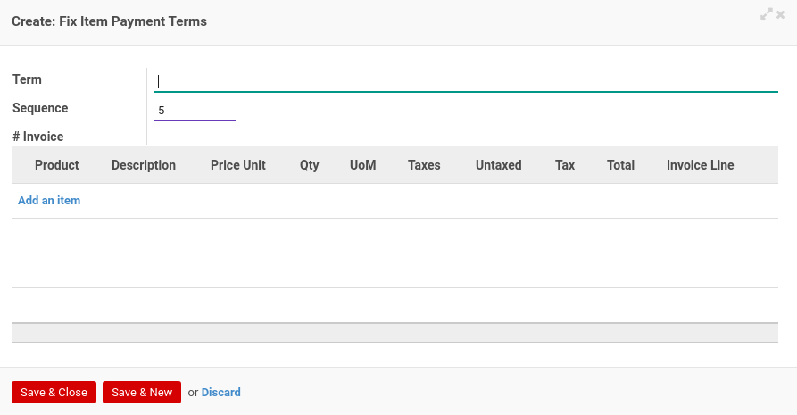

# Penjelasan Service Contract

Informasi pada *Service Contract* dibagi menjadi beberapa bagian, yaitu:

* [Header](#bagian-header)
* [Tab Fix Items](#tab-fix-items)
* [Tab Teams](#tab-teams)
* [Tab Custom Information](#tab-custom-information)
* [Tab Analytic & Project](#tab-analytic-project)
* [Tab Reviews](#tab-reviews)
* [Tab Policies](#tab-policies)
* [Tab Logs](#tab-logs)
* [Tab Notes](#tab-notes)

### <a name="bagian-header">HEADER</a>

#### <a name="field-no-document"># Document</a>

Nomor dokumen.

#### <a name="field-title">Title</a>

Judul kontrak.

#### <a name="field-default-operating-unit">Default Operating Unit</a>

Operating unit yang memiliki dokumen.

#### <a name="field-no-quotation"># Quotation</a>

Nomor penawaran. Informasi akan terisi otomatis.

#### <a name="field-partner">Partner</a>

Nama calon klien/konsumen.

#### <a name="field-type">Type</a>

Tipe service.

#### <a name="field-salesman">Salesman</a>

Nama tenaga penjualan.

#### <a name="field-responsible">Responsible</a>

Nama penanggung jawab jasa yang ditawarkan.

#### <a name="field-currency">Currency</a>

Mata uang yang digunakan.

#### <a name="field-pricelist">Pricelist</a>

Standar daftar harga yang digunakan.

#### <a name="field-contract-date">Contract Date</a>

Tanggal kontrak.

#### <a name="field-start-date">Start Date</a>

Tanggal estimasi dimulainya jasa.

#### <a name="field-end-date">End Date</a>

Tanggal estimasi diakhirinya jasa.

#### <a name="tab-fix-items">TAB FIX ITEMS</a>

*Pop Up Payment Term* saat *add an item* diklik.

#### <a name="field-receivable-journal">Receivable Journal</a>

Pengaturan accounting receivable journal.

#### <a name="field-receivable-account">Receivable Account</a>

Pengaturan accounting receivable account.

#### <a name="field-items">Items</a>

Items jasa yang ditawarkan pada kontrak.

#### <a name="field-term">Term</a>

Deskripsi termin pembayaran.

#### <a name="field-sequence">Sequence</a>

Urutan termin pembayaran.

#### <a name="field-product">Product</a>

Nama produk.

#### <a name="field-description">Description</a>

Deskripsi produk.

#### <a name="field-price-unit">Price Unit</a>

Harga per unit.

#### <a name="field-qty">Qty</a>

Jumlah unit.

#### <a name="field-uom">UoM</a>

Ukuran per unit (satuan).

#### <a name="field-taxes">Taxes</a>

Pajak yang dikenakan untuk produk.

#### <a name="field-untaxed">Untaxed</a>

Perkalian dari Price Unit x Qty

#### <a name="field-tax">Tax</a>

Pajak yang dikenakan terhadap Untaxed.

#### <a name="field-total">Total</a>

Penambahan dari Untaxed + Tax.

#### <a name="field-invoice-line">Invoice Line</a>

Referensi Invoice.

#### <a name="tab-teams">TAB TEAMS</a>

#### <a name="field-function">Function</a>

Nama Fungsi.

#### <a name="field-team">Team</a>

Nama Team.

#### <a name="tab-custom-information">TAB CUSTOM INFORMATION</a>

#### <a name="field-custom-information-template">Custom Information Template</a>

Template custom information yang digunakan.

#### <a name="tab-analytic-project">TAB ANALYTIC & PROJECT</a>

#### <a name="field-parent-analytic-account">Parent Analytic Account</a>

Akun analitik induk yang digunakan.

#### <a name="field-analytic-account">Analytic Account</a>

Akun analitik yang digunakan.

#### <a name="field-auto-create-project">Auto Create Project</a>

Penanda pembuatan proyek secara otomatis diaktifkan.

#### <a name="field-project">Project</a>

Nama proyek yang digunakan.

#### <a name="tab-reviews">TAB REVIEWS</a>

#### <a name="field-definition">Definition</a>

Template multiple review yang digunakan.

#### <a name="field-review-partners-validations">Review Partners Validations</a>

Daftar nama user yang sedang ditunggu persetujuannya.

#### <a name="tab-policies">TAB POLICIES</a>

#### <a name="field-confirm">Can Confirm</a>

Apabila aktif user dapat mengkonfirmasi kontrak.

#### <a name="field-restart-approval">Can Restart Approval</a>

Apabila aktif user dapat merestart persetujuan kontrak.

#### <a name="field-force-start">Can Force Start</a>

Apabila aktif user dapat memaksa untuk memulai kontrak.

#### <a name="field-force-finish">Can Force Finish</a>

Apabila aktif user dapat memaksa untuk menyelesaikan kontrak.

#### <a name="field-cancel">Can Cancel</a>

Apabila aktif user dapat membatalkan kontrak.

#### <a name="field-terminate">Can Terminate</a>

Apabila aktif user dapat mengakhiri kontrak.

#### <a name="field-restart">Can Restart</a>

Apabila aktif user dapat merestart kontrak.

#### <a name="tab-logs">TAB LOGS</a>

#### <a name="field-confirmation">Confirmation</a>

Waktu konfirmasi dan user yang mengkonfirmasi kontrak.

#### <a name="field-start">Start</a>

Waktu mulai dan user yang memulai kontrak.

#### <a name="field-finish">Finish</a>

Waktu selesai dan user yang menyelesaikan kontrak.

#### <a name="field-cancellation">Cancellation</a>

Waktu batal dan user yang membatalkan kontrak.

#### <a name="field-termination">Termination</a>

Waktu akhir dan user yang mengakhiri kontrak.

#### <a name="tab-notes">TAB NOTES</a>

#### <a name="field-notes">Notes</a>

Catatan.
