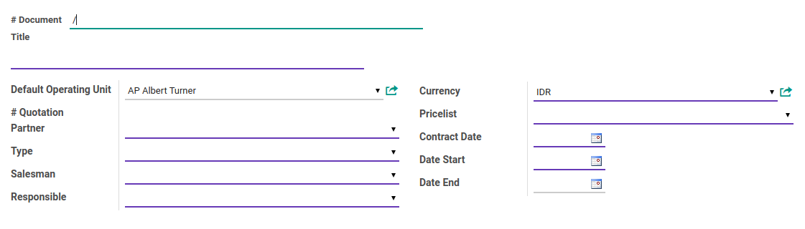
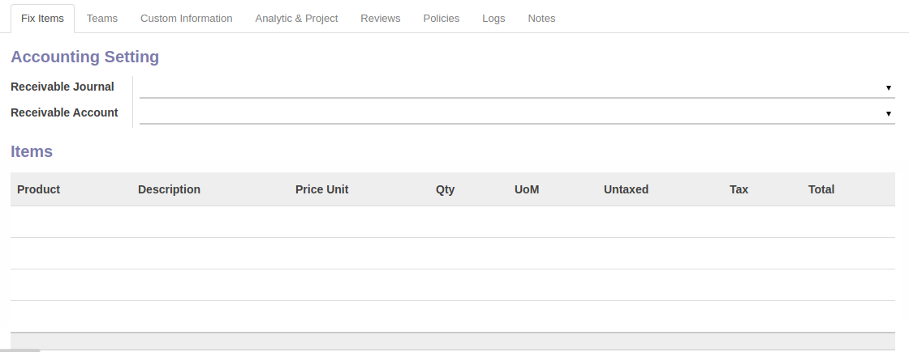
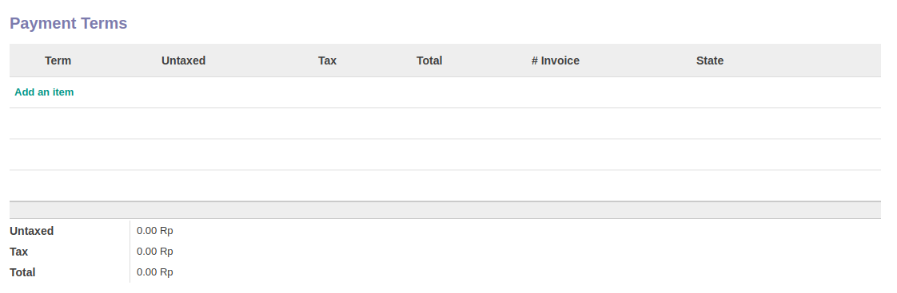
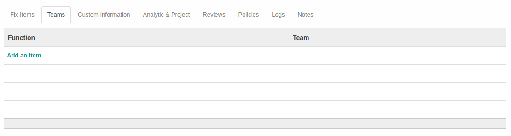
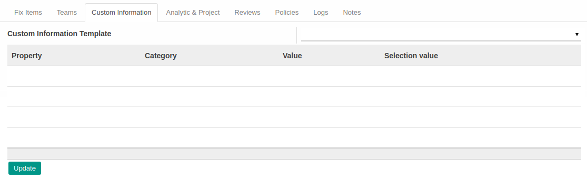
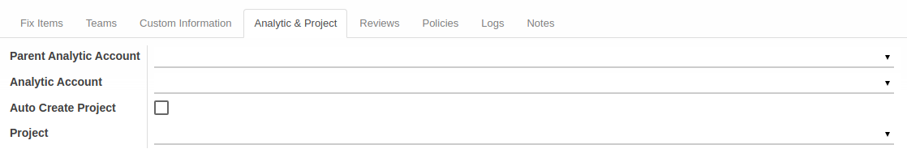
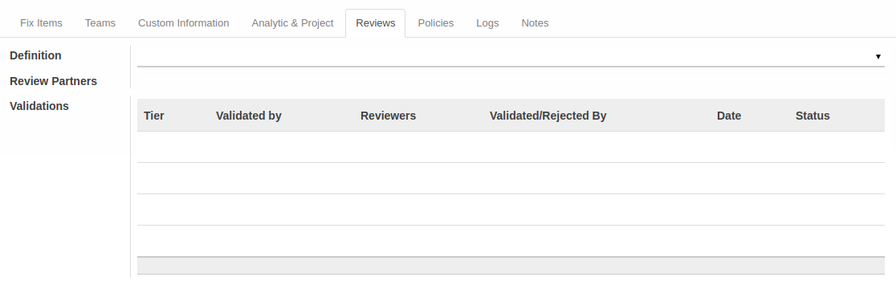
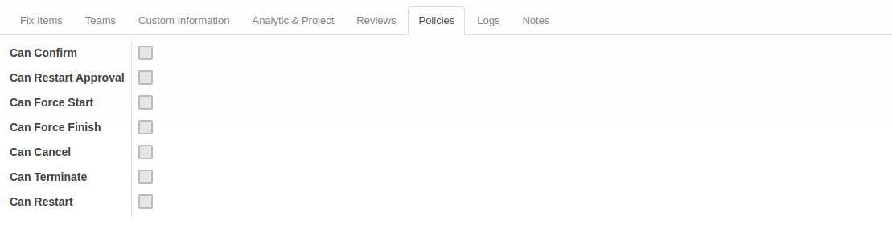
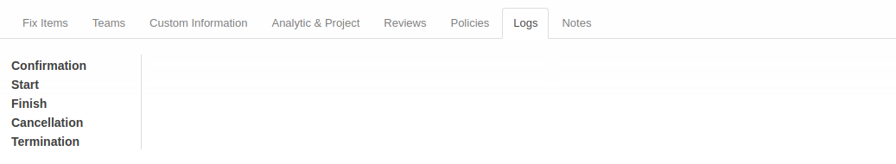
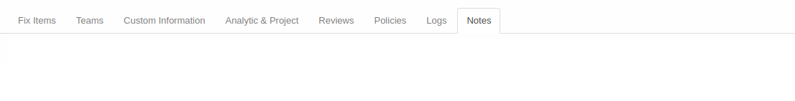

# Penjelasan Service Contract

Informasi pada *Service Contract* dibagi menjadi beberapa bagian, yaitu:

* [Header](#bagian-header)
* [Tab Fix Items](#tab-fix-items)
* [Tab Teams](#tab-teams)
* [Tab Custom Information](#tab-custom-information)
* [Tab Analytic & Project](#tab-analytic-project)
* [Tab Reviews](#tab-reviews)
* [Tab Policies](#tab-policies)
* [Tab Logs](#tab-logs)
* [Tab Notes](#tab-notes)

### <a name="bagian-header">HEADER</a>

#### <a name="field-no-document"># Document</a>

Nomor dokumen.

#### <a name="field-title">Title</a>

Judul kontrak.

#### <a name="field-default-operating-unit">Default Operating Unit</a>

Operating unit yang memiliki dokumen.

#### <a name="field-no-quotation"># Quotation</a>

Nomor penawaran. Informasi akan terisi otomatis apabila *service contract* dihasilkan secara otomatis dari *service quotation*.

#### <a name="field-partner">Partner</a>

Nama klien, dapat berupa company partner ataupun invidual partner.

#### <a name="field-type">Type</a>

Tipe service.

#### <a name="field-salesman">Salesman</a>

Nama *salesperson* yang bertanggung jawab terhadap penjualan/administrasi penjualan.

#### <a name="field-responsible">Responsible</a>

Nama penanggung jawab jasa yang ditawarkan.

#### <a name="field-currency">Currency</a>

Mata uang yang digunakan.

#### <a name="field-pricelist">Pricelist</a>

Standar daftar harga yang digunakan.

#### <a name="field-contract-date">Contract Date</a>

Tanggal kontrak.

#### <a name="field-start-date">Start Date</a>

Tanggal estimasi dimulainya jasa.

#### <a name="field-end-date">End Date</a>

Tanggal estimasi diakhirinya jasa.

#### <a name="tab-fix-items">TAB FIX ITEMS</a>

#### <a name="field-accounting-setting">ACCOUNTING SETTING</a>

Pengaturan akuntansi.

#### <a name="field-receivable-journal">Receivable Journal</a>

Buku jurnal yang digunakan untuk pembuatan customer invoice tiap term.

#### <a name="field-receivable-account">Receivable Account</a>

Akun piutang yang digunakan untuk pembuatan customer invoice tiap term.

#### <a name="field-items">Tabel ITEMS</a>

Detail item yang dideliver oleh *service contract*. Tabel ini akan terisi otomatis berdasarkan data yang diimput pada tabel **[Payment Terms](#field-payment-terms)**.

#### <a name="field-items-product">Product</a>

Nama item.

#### <a name="field-items-description">Description</a>

Deskripsi item.

#### <a name="field-items-price-unit">Price Unit</a>

Harga per unit.

#### <a name="field-items-qty">Qty</a>

Jumlah unit.

#### <a name="field-items-uom">UoM</a>

Ukuran per unit (satuan).

#### <a name="field-items-untaxed">Untaxed</a>

Perkalian dari Price Unit x Qty

#### <a name="field-items-tax">Tax</a>

Pajak yang dikenakan terhadap Untaxed. Dapat lebih dari 1.

#### <a name="field-items-total">Total</a>

Penambahan dari Untaxed + Tax.

#### <a name="field-payment-terms">Tabel PAYMENT TERMS</a>

Termin pembayaran *service contract* beserta item-item di tiap terminnya.

#### <a name="field-term">Term</a>

Deskripsi termin pembayaran.

#### <a name="field-sequence">Sequence</a>

Urutan termin pembayaran.

#### <a name="field-no-invoice"># Invoice</a>

Nomor Invoice. Akan terisi otomatis jika termin sudah diinvoice.

#### <a name="field-product">Product</a>

Nama item.

#### <a name="field-description">Description</a>

Deskripsi item.

#### <a name="field-price-unit">Price Unit</a>

Harga per unit.

#### <a name="field-qty">Qty</a>

Jumlah unit.

#### <a name="field-uom">UoM</a>

Ukuran per unit (satuan).

#### <a name="field-taxes">Taxes</a>

Pajak yang dikenakan untuk produk. Dapat dikenakan lebih dari 1.

#### <a name="field-untaxed">Untaxed</a>

Perkalian dari Price Unit x Qty

#### <a name="field-tax">Tax</a>

Pajak yang dikenakan terhadap Untaxed.

#### <a name="field-total">Total</a>

Penambahan dari Untaxed + Tax.

#### <a name="field-invoice-line">Invoice Line</a>

Referensi Invoice.

#### <a name="tab-teams">TAB TEAMS</a>

#### <a name="tabel-teams">TABEL Teams</a>

Daftar nama tim dan tanggung jawabnya dalam menyelesaikan *service contract*.

#### <a name="field-function">Function</a>

Nama fungsi/jabatan di dalam penyelesaian pekerjaan.

#### <a name="field-team">Team</a>

Nama tim.

#### <a name="tab-custom-information">TAB CUSTOM INFORMATION</a>

#### <a name="field-custom-information-template">Custom Information Template</a>

Template *custom information* yang digunakan.

#### <a name="tabel-customer-information">TABEL Custom Information</a>

Data-data *custom information*.

#### <a name="field-custom-information-property">Property</a>

Jenis *custom information*.

#### <a name="field-custom-information-category">Category</a>

Kategori *custom information*.

#### <a name="field-custom-information-value">Value</a>

Nilai dari *custom information*.

#### <a name="field-custom-information-selection-value">Selection Value</a>

Pilihan-pilihan yang disediakan. Hanya dapat diisi apabila *custom information* bertipe *selection*.

#### <a name="tab-analytic-project">TAB ANALYTIC & PROJECT</a>

#### <a name="field-parent-analytic-account">Parent Analytic Account</a>

Akun analitik induk yang digunakan.

#### <a name="field-analytic-account">Analytic Account</a>

Akun analitik yang digunakan. Apabila dikosongkan maka *analytic account* akan otomatis dibuat ketika *service contract* disetujui (mempunyai status **Ready to Start**).

#### <a name="field-auto-create-project">Auto Create Project</a>

Apabila diaktifkan maka *service contract* akan secara otomatis membuat *project* ketika disetujui (mempunyai status **Ready to Start**).

#### <a name="field-project">Project</a>

*Project* yang otomatis dibuat apabila **Auto Create Project** diaktifkan.

#### <a name="tab-reviews">TAB REVIEWS</a>

#### <a name="field-definition">Definition</a>

Template multiple approval yang digunakan.

#### <a name="field-review-partners-validations">Review Partners Validations</a>

Nama-nama user yang dapat menyetujui/menolak *service contract*

#### <a name="tabel-validations">TABEL Validations</a>

Tahapan-tahapan persetujuan *service contract*

#### <a name="field-validations-tier">Tier</a>

Urutan persetujuan

#### <a name="field-validations-validated-by">Validated By</a>

Metode pemilihan user-user yang dapat menyetujui/menolak *service contract*. Metode pemilihan terdiri dari 3 (tiga) yaitu:

1. *Specific user*. User-user yang dapat menyetujui/menolah *service contract* ditentukan langsung.
2. *Any user in specific group*. User-user yang dapat menyetujui/menolak *service contract* adalah user-user yang tergabung dalam kelompok-kelompok user yang ditentukan.
3. *Both specific user and group*. User-user yang dapat menyetujui/menolah *service contract* ditentukan langsung ditambah dengan user-user yang tergabung dalam kelompok-kelompok user yang ditentukan.
4. *Python code*. User-user yang dapat menyetujui/menolah *service contract* ditentukan oleh algoritma kode python tertentu

#### <a name="field-validations-reviewers">Reviewers</a>

Nama-nama user yang dapat menyetujui/menolak *service contract* pada *tier* yang dimaksud.

#### <a name="field-validations-validated-rejected">Validated/Rejected By</a>

User yang menyetujui/menolak *service contract*.

#### <a name="field-validations-date">Date</a>

Tanggal dan waktu **Validated/Rejected By** menyetujui/menolak *service contract*

#### <a name="field-validations-date">Status</a>

Status persetujuan, terdiri dari 2 (dua) kemungkinan:

1. **Approved**. Tier disetujui.
2. **Rejected**. Tier ditolak.

#### <a name="tab-policies">TAB POLICIES</a>

#### <a name="field-confirm">Can Confirm</a>

Berhak/tidaknya user aktif untuk dapat mengkonfirmasi service contract

#### <a name="field-restart-approval">Can Restart Approval</a>

Berhak/tidaknya user aktif untuk dapat merestart persetujuan service contract

#### <a name="field-force-start">Can Start</a>

Berhak/tidaknya user aktif untuk dapat memulai service contract

#### <a name="field-force-finish">Can Finish</a>

Berhak/tidaknya user aktif untuk dapat menyelesaikan service contract

#### <a name="field-cancel">Can Cancel</a>

Berhak/tidaknya user aktif untuk dapat membatalkan service contract

#### <a name="field-terminate">Can Terminate</a>

Berhak/tidaknya user aktif untuk dapat mengakhiri paksa service contract

#### <a name="field-restart">Can Restart</a>

Berhak/tidaknya user aktif untuk dapat merestart service contract

#### <a name="tab-logs">TAB LOGS</a>

#### <a name="field-confirmation">Confirmation</a>

Waktu konfirmasi dan user yang mengkonfirmasi kontrak.

#### <a name="field-start">Start</a>

Waktu mulai dan user yang memulai kontrak.

#### <a name="field-finish">Finish</a>

Waktu selesai dan user yang menyelesaikan kontrak.

#### <a name="field-cancellation">Cancellation</a>

Waktu batal dan user yang membatalkan kontrak.

#### <a name="field-termination">Termination</a>

Waktu akhir dan user yang mengakhiri kontrak.

#### <a name="tab-notes">TAB NOTES</a>

#### <a name="field-notes">Notes</a>

Catatan.
