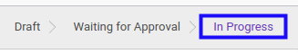
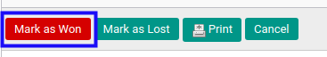
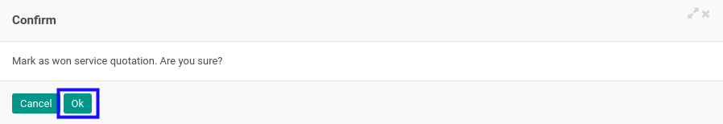
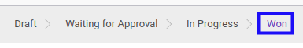

# Memenangkan Service Quotation

## A. INPUT

* Data *Service Quotation* yang dapat dimenangkan harus memiliki status **In Progress**.

* User yang akan memenangkan harus memiliki akses untuk memenangkan *Service Quotation*.

## B. LANGKAH KERJA

1. Buka menu **Service -> Service -> Quotation**. Abaikan jika sudah berada pada menu yang dimaksud.
2. Buka data *Service Quotation* yang akan dimenangkan. Abaikan jika data sudah dibuka.
3. Klik tombol **Mark As Won** pada bagian atas-kiri form.

4. Klik tombol **Ok** pada *pop-up* konfirmasi pemenangan yang muncul.

## C. OUTPUT

* Data *Service Quotation* akan berubah menjadi status Won.

