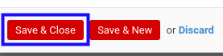
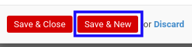

# Memodifikasi Detail Termin Pembayaran

*(Instruksi kerja ini merupakan sub instruksi dari (1) [Menambahkan Termin Pembayaran](./menambahkan-termin.md), atau (2) [Memodifikasi Termin Pembayaran](./memodifikasi-termin.md). Instruksi kerja ini tidak bisa berdiri sendiri)*

## A. INPUT

*(Tidak ada instruksi khusus)*

## B. LANGKAH KERJA

1. Pilih dan sesuaikan **[Product](./penjelasan.md#field-product)** jika dibutuhkan. Wajib diisi.
2. Isi dan sesuaikan **[Description](./penjelasan.md#field-description)** jika dibutuhkan. Wajib diisi.
3. Isi dan sesuaikan **[Price Unit](./penjelasan.md#field-price-unit)** jika dibutuhkan. Wajib diisi.
4. Isi dan sesuaikan **[Qty](./penjelasan.md#field-qty)** jika dibutuhkan. Wajib diisi.
5. Pilih dan sesuaikan **[UoM](./penjelasan.md#field-uom)** jika dibutuhkan. Wajib diisi.
6. Pilih dan sesuaikan **[Taxes](./penjelasan.md#field-taxes)** jika dibutuhkan. Wajib diisi.
7. Klik tombol **Save & Close** pada bagian bawah-kiri pop-up **Payment Terms** untuk menyimpan data. Klik tombol **Save & New** pada bagian bawah-kiri pop-up **Payment Terms** untuk menyimpan data dan menambahkan data baru.

8. Ulangi mulai langkah ke-1 jika pada langkah ke-7 tombol **Save & New** yang dipilih.
9. Lanjutkan [langkah ke-5 instruksi kerja Menambahkan Termin Pembayaran](./menambahkan-termin.md#l5) atau [langkah ke-4 instruksi kerja Memodifikasi Termin Pembayaran](./memodifikasi-termin.md#l4).

## C. OUTPUT

*(Tidak ada instruksi khusus)*
