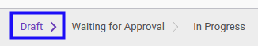
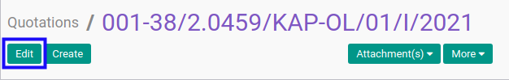
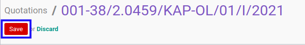

# Memodifikasi Service Quotation

## A. INPUT

* Data *Service Quotation* yang dapat dimodifikasi harus memiliki status **Draft**.

* User yang akan memodifikasi harus memiliki akses untuk memodifikasi *Service Quotation*.

## B. LANGKAH KERJA

1. Buka menu **Service -> Service -> Quotation**. Abaikan jika sudah berada pada menu yang dimaksud.
2. Buka data *Service Quotation* yang akan dimodifikasi. Abaikan jika data sudah dibuka.
3. Klik tombol **Edit** pada bagian atas-kiri form.

4. Ubah **[# Document](./penjelasan.md#field-no-document)** jika dibutuhkan. Wajib diisi.
5. Isi dan sesuaikan **[Title](./penjelasan.md#field-title)** jika dibutuhkan. Wajib diisi.
6. Pilih dan sesuaikan **[Default Operating Unit](./penjelasan.md#field-default-operating-unit)** jika dibutuhkan. Tidak wajib diisi.
7. Pilih dan sesuaikan **[Partner](./penjelasan.md#field-partner)** jika dibutuhkan. Wajib diisi.
8. Pilih dan sesuaikan **[Type](./penjelasan.md#field-type)** jika dibutuhkan. Wajib diisi.
9. Pilih dan sesuaikan **[Responsible](./penjelasan.md#field-responsible)** jika dibutuhkan. Wajib diisi.
10. Pilih dan sesuaikan **[Currency](./penjelasan.md#field-currency)** jika dibutuhkan. Wajib diisi.
11. Pilih dan sesuaikan **[Pricelist](./penjelasan.md#field-pricelist)** jika dibutuhkan. Wajib diisi.
12. Pilih dan sesuaikan **[Quotation Date](./penjelasan.md#field-quotation-date)** jika dibutuhkan. Wajib diisi.
13. Pilih dan sesuaikan **[Start Date](./penjelasan.md#field-start-date)** jika dibutuhkan. Tidak wajib diisi.
14. Pilih dan sesuaikan **[End Date](./penjelasan.md#field-end-date)** jika dibutuhkan. Tidak wajib diisi.
15. Beralih ke tab **[Fix Items](./penjelasan.md#tab-fix-items)**.
16. <a name="l16">[Tambah](./menambahkan-termin.md)/[Modifikasi](./memodifikasi-termin.md)/[Hapus](./menghapus-termin.md) **Payment Terms**</a>. Ulangi langkah ini sampai **Payment Terms** sesuai dengan keinginan.
17. Klik tombol **Save** pada bagian atas-kiri form.

## C. OUTPUT

* Data *Service Quotation* akan berubah sesuai dengan perubahan yang dilakukan.
