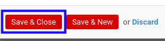

# Menambahkan Detail Termin Pembayaran

*(Instruksi kerja ini merupakan sub instruksi dari (1) [Menambahkan Termin Pembayaran](./menambahkan-termin.md), atau (2) [Memodifikasi Termin Pembayaran](./memodifikasi-termin.md). Instruksi kerja ini tidak bisa berdiri sendiri)*

## A. INPUT

*(Tidak ada instruksi khusus)*

## B. LANGKAH KERJA

1. Klik label **Add an Item** pada bagian atas-kiri tabel ***Fix Item Payment Terms***

2. Pilih **[Product](./penjelasan.md#field-product)**. Wajib diisi.
3. Isi **[Description](./penjelasan.md#field-description)**. Wajib diisi.
4. Isi **[Price Unit](./penjelasan.md#field-price-unit)**. Wajib diisi.
5. Isi **[Qty](./penjelasan.md#field-qty)**. Wajib diisi.
6. Pilih **[UoM](./penjelasan.md#field-uom)**. Wajib diisi.
7. Pilih **[Taxes](./penjelasan.md#field-taxes)**. Wajib diisi.
8. Klik tombol **Save & Close** pada bagian bawah-kiri pop-up **Payment Terms** untuk menyimpan data. Klik tombol **Save & New** pada bagian bawah-kiri pop-up **Payment Terms** untuk menyimpan data dan menambahkan data baru.

9. Ulangi mulai langkah ke-1 jika pada langkah ke-8 tombol **Save & New** yang dipilih.
10. Lanjutkan [langkah ke-5 instruksi kerja Menambahkan Termin Pembayaran](./menambahkan-termin.md#l5) atau [langkah ke-4 instruksi kerja Memodifikasi Termin Pembayaran](./memodifikasi-termin.md#l4).

## C. OUTPUT

*(Tidak ada instruksi khusus)*
