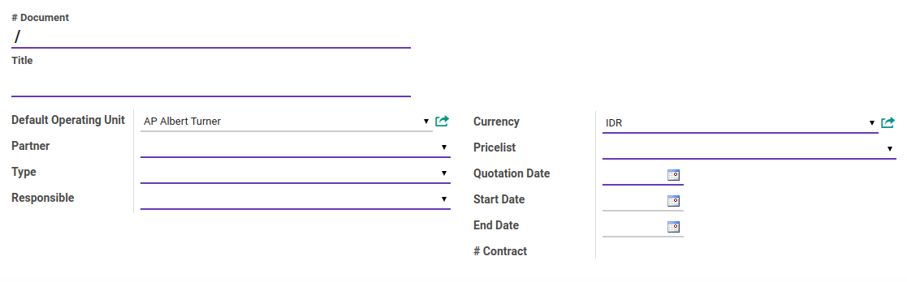
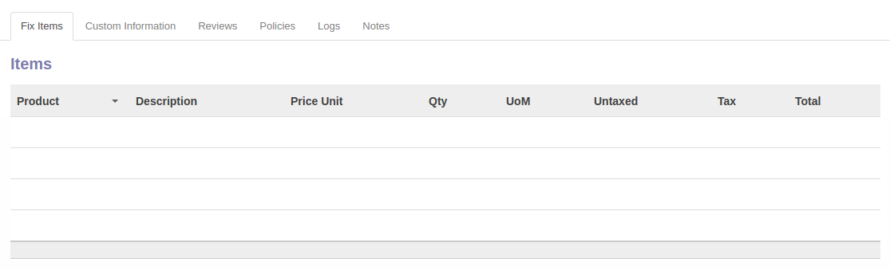
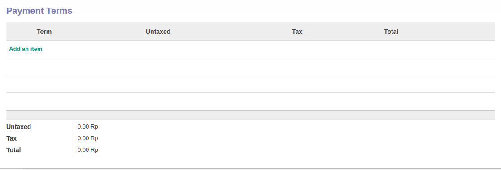
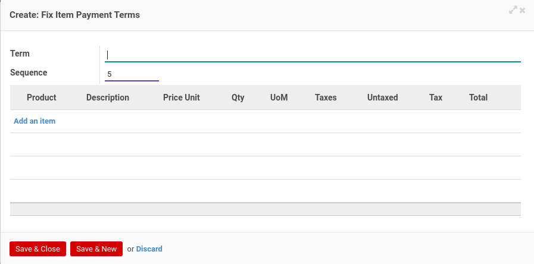
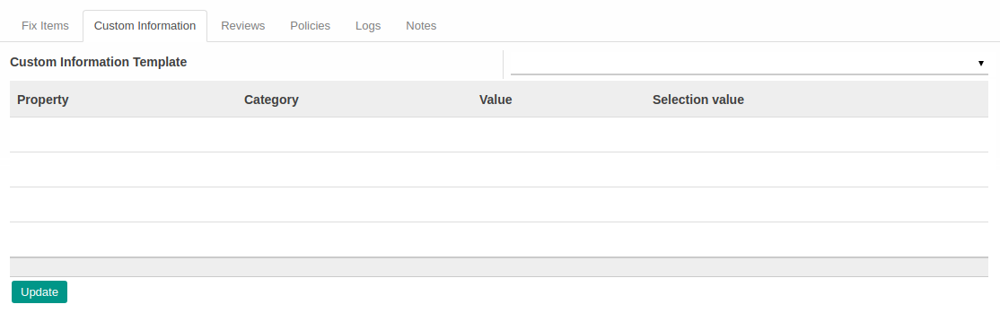
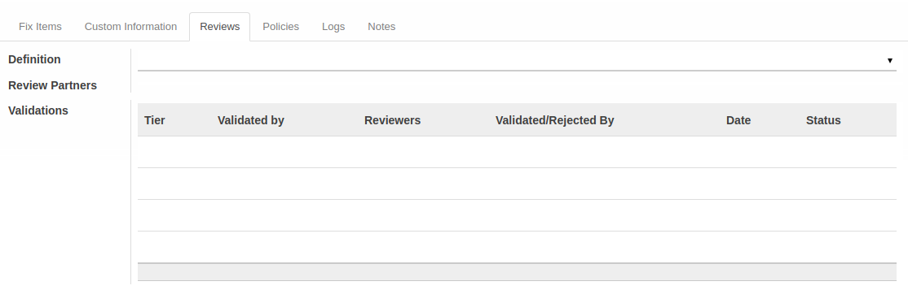
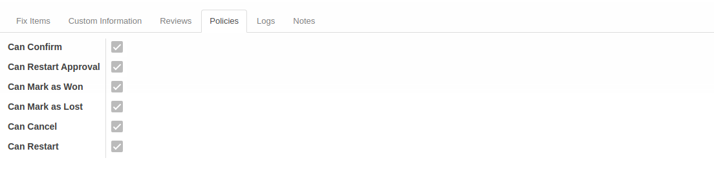
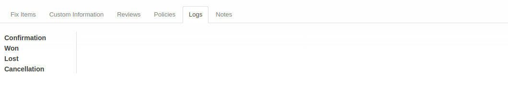
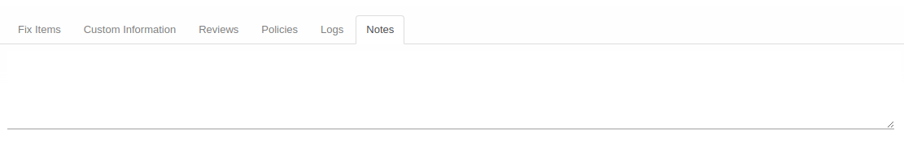

# Penjelasan Service Quotation

Informasi pada *Service Quotation* dibagi menjadi beberapa bagian, yaitu:

* [Header](#bagian-header)
* [Tab Fix Items](#tab-fix-items)
* [Tab Custom Information](#tab-custom-information)
* [Tab Reviews](#tab-reviews)
* [Tab Policies](#tab-policies)
* [Tab Logs](#tab-logs)
* [Tab Notes](#tab-notes)

### <a name="bagian-header">HEADER</a>

#### <a name="field-no-document"># Document</a>

Nomor dokumen.

#### <a name="field-title">Title</a>

Judul penawaran.

#### <a name="field-default-operating-unit">Default Operating Unit</a>

Operating unit yang memiliki dokumen.

#### <a name="field-partner">Partner</a>

Nama calon klien/konsumen.

#### <a name="field-type">Type</a>

Tipe service.

#### <a name="field-responsible">Responsible</a>

Nama penanggung jawab jasa yang ditawarkan.

#### <a name="field-currency">Currency</a>

Mata uang yang digunakan.

#### <a name="field-pricelist">Pricelist</a>

Standar daftar harga yang digunakan.

#### <a name="field-quotation-date">Quotation Date</a>

Tanggal quotation.

#### <a name="field-start-date">Start Date</a>

Tanggal estimasi dimulainya jasa.

#### <a name="field-end-date">End Date</a>

Tanggal estimasi diakhirinya jasa.

#### <a name="field-no-contract"># Contract</a>

Nomor kontrak. Informasi akan terisi otomatis ketika penawaran dimenangkan.

#### <a name="tab-fix-items">TAB FIX ITEMS</a>

*Pop Up Payment Term* saat *add an item* diklik.

#### <a name="field-items">Tabel ITEMS</a>

Detail item yang dideliver oleh *service quotation*. Tabel ini akan terisi otomatis berdasarkan data yang diinput pada tabel **[Payment Terms](#field-payment-terms)**.

#### <a name="field-items-product">Product</a>

Nama item.

#### <a name="field-items-description">Description</a>

Deskripsi item.

#### <a name="field-items-price-unit">Price Unit</a>

Harga per unit.

#### <a name="field-items-qty">Qty</a>

Jumlah unit.

#### <a name="field-items-uom">UoM</a>

Ukuran per unit (satuan).

#### <a name="field-items-untaxed">Untaxed</a>

Perkalian dari Price Unit x Qty

#### <a name="field-items-tax">Tax</a>

Pajak yang dikenakan terhadap Untaxed. Dapat lebih dari 1.

#### <a name="field-items-total">Total</a>

Penambahan dari Untaxed + Tax.

#### <a name="field-payment-terms">Tabel PAYMENT TERMS</a>

Termin pembayaran *service quotaton* beserta item-item di tiap terminnya.

#### <a name="field-term">Term</a>

Deskripsi termin pembayaran.

#### <a name="field-sequence">Sequence</a>

Urutan termin pembayaran.

#### <a name="field-product">Product</a>

Nama item.

#### <a name="field-description">Description</a>

Deskripsi item.

#### <a name="field-price-unit">Price Unit</a>

Harga per unit.

#### <a name="field-qty">Qty</a>

Jumlah unit.

#### <a name="field-uom">UoM</a>

Ukuran per unit (satuan).

#### <a name="field-taxes">Taxes</a>

Pajak yang dikenakan untuk produk. Dapat dikenakan lebih dari 1.

#### <a name="field-untaxed">Untaxed</a>

Perkalian dari Price Unit x Qty

#### <a name="field-tax">Tax</a>

Pajak yang dikenakan terhadap Untaxed

#### <a name="field-total">Total</a>

Penambahan dari Untaxed + Tax

#### <a name="tab-custom-information">TAB CUSTOM INFORMATION</a>

#### <a name="field-custom-information-template">Custom Information Template</a>

Template custom information yang digunakan.

#### <a name="tab-reviews">TAB REVIEWS</a>

#### <a name="field-definition">Definition</a>

Template multiple review yang digunakan

#### <a name="field-review-partners-validations">Review Partners Validations</a>

Daftar nama user yang sedang ditunggu persetujuannya.

#### <a name="tab-policies">TAB POLICIES</a>

#### <a name="field-confirm">Can Confirm</a>

Berhak/tidaknya user aktif untuk dapat mengkonfirmasi service quotation

#### <a name="field-restart-approval">Can Restart Approval</a>

Berhak/tidaknya user aktif untuk dapat merestart persetujuan service quotation

#### <a name="field-mark-as-won">Can Mark As Won</a>

Berhak/tidaknya user aktif untuk dapat menandai service quotation sebagai menang

#### <a name="field-mark-as-lost">Can Mark As Lost</a>

Berhak/tidaknya user aktif untuk dapat menandai service quotation sebagai kalah

#### <a name="field-cancel">Can Cancel</a>

Berhak/tidaknya user aktif untuk dapat membatalkan service quotation

#### <a name="field-restart">Can Restart</a>

Berhak/tidaknya user aktif untuk dapat merestart service quotation

#### <a name="tab-logs">TAB LOGS</a>

#### <a name="field-confirmation">Confirmation</a>

Waktu konfirmasi dan user yang mengkonfirmasi penawaran.

#### <a name="field-won">Won</a>

Waktu menang dan user yang memenangkan penawaran.

#### <a name="field-lost">Lost</a>

Waktu kalah dan user yang mengalahkan penawaran.

#### <a name="field-cancellation">Cancellation</a>

Waktu batal dan user yang membatalkan penawaran

#### <a name="tab-notes">TAB NOTES</a>

#### <a name="field-notes">Notes</a>

Catatan.
